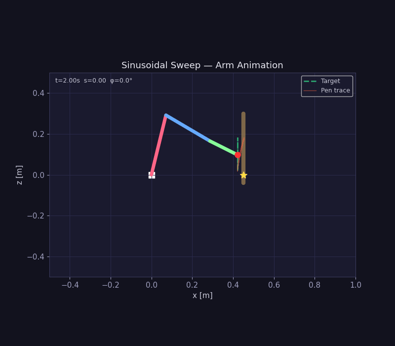

# Chopstick Crane Simulator

A MuJoCo-based simulation of a 3-link robotic crane arm sweeping a pen across a vertically mounted, spring-loaded oscillating board.

The controller uses Damped Least-Squares (DLS) Inverse Kinematics (IK) combined with an Admittance Force Controller to gracefully maintain a steady contact force (target 3.75N) while compensating for the board's dynamic tilting and bouncing.

Developed as a selection task for the Junior Research Fellowship (JRF) position at the INTERFACE Lab, IIT Madras.



## Results

- **Tracking error:** 5.4 mm (mean end-effector position error along the reference trajectory)
- Stable force regulation around the 3.75N target despite board tilt and bounce
- Stable behavior through simulated singular configurations

📹 [Watch full demo (40.1s)](media/demo.mp4)

## System Design


🔗 [Explore the full interactive system design on Whimsical](https://whimsical.com/arshitha-s-workspace/chopstick-crane-BmWHVDkr3XFUijBujALigq)

## Method

### Kinematic Model
The arm is modeled as a 3-link planar manipulator with revolute joints, simulated in MuJoCo's physics engine.

### Inverse Kinematics — Damped Least Squares (DLS)
Standard Jacobian pseudoinverse IK becomes numerically unstable near kinematic singularities, producing large, unrealistic joint velocities. DLS resolves this by adding a damping term to the pseudoinverse solution, trading a small amount of tracking accuracy near singularities for numerical stability and smoother joint motion:

```
Δθ = Jᵀ(JJᵀ + λ²I)⁻¹ Δx
```

where λ is the damping factor, tuned to balance tracking precision against singularity robustness.

### Force Control — Admittance
Rather than directly controlling end-effector stiffness (impedance control), an admittance controller maps sensed contact force error (relative to the 3.75N target) to a corrective velocity/position response, allowing the pen tip to comply with the board's motion while maintaining steady contact force.

## Project Structure

The project is split into four primary files to cleanly separate physics modelling, mathematical kinematics, control logic, and visualization.

```
.
├── model.xml           # MuJoCo XML scene file: arm, spring-loaded board, pen tip, lights, cameras
├── kinematics.py        # Forward kinematics, analytical Jacobian, board surface geometry
├── controller.py         # DLS IK + admittance force control loop
├── simulate.py            # Simulation runner: physics loop, logging, video rendering
├── plot_results.py         # Reads logs, generates performance plots
├── requirements.txt
├── results/               # Output logs, videos, and plots from simulate.py / plot_results.py
├── media/                 # demo.gif, demo.mp4, Chopstick crane.png
├── report.pdf             # Two-page task report
└── README.md
```

* **`model.xml`**: The MuJoCo XML scene file. This defines the physical world: the 3-link robotic arm, the spring-loaded vertical board, the pen tip, lighting, and the virtual cameras.
* **`kinematics.py`**: The mathematical foundation. Contains the forward kinematics, the analytical Jacobian matrix, and the geometric definitions for the board's surface. It defines the exact mathematical trajectory the robot should trace.
* **`controller.py`**: The brain of the robot. Contains the closed-loop control logic that reads sensor data from the physics engine, computes the required joint velocities using DLS IK, regulates force using Admittance control, and sends commands back to the actuators.
* **`simulate.py`**: The simulation runner. Initializes the MuJoCo physics engine, injects the controller into the simulation loop, records logs, and renders the output videos.
* **`plot_results.py`**: The data visualization script. Reads the saved simulation logs and generates standard performance plots (force regulation, tracking error, board tilt oscillations).

## Installation

Ensure you have Python 3.10+ installed. Install the required dependencies using:

```bash
pip install -r requirements.txt
```

## How to Run

1. **Run the Simulation:**
   Run the main simulation script. This will execute the 40-second continuous sweep simulation (demonstrating long-term controller stability) and save logs and videos to the `results/` folder.
   ```bash
   python simulate.py
   ```
   *Note: By default, this will automatically record and save videos from 3 different angles (`simulation_side.mp4`, `simulation_front.mp4`, and `simulation_top.mp4`).*

2. **Generate Performance Plots:**
   After running the simulation, generate the plots to view the tracking and force regulation performance:
   ```bash
   python plot_results.py
   ```
   The plots will be saved as PNG images in the `results/` folder.

## Limitations & Future Work

- Extension to a spatial (3D) manipulator
- Adaptive admittance parameters for varying board stiffness/damping
- Comparison against impedance control for the same task

## Acknowledgment

This project was developed as part of the selection task for the Junior Research Fellowship (JRF) position at the **INTERFACE Lab, Department of Applied Mechanics and Biomedical Engineering, IIT Madras**.

## License

This project is licensed under the MIT License — see the [LICENSE](LICENSE) file for details.